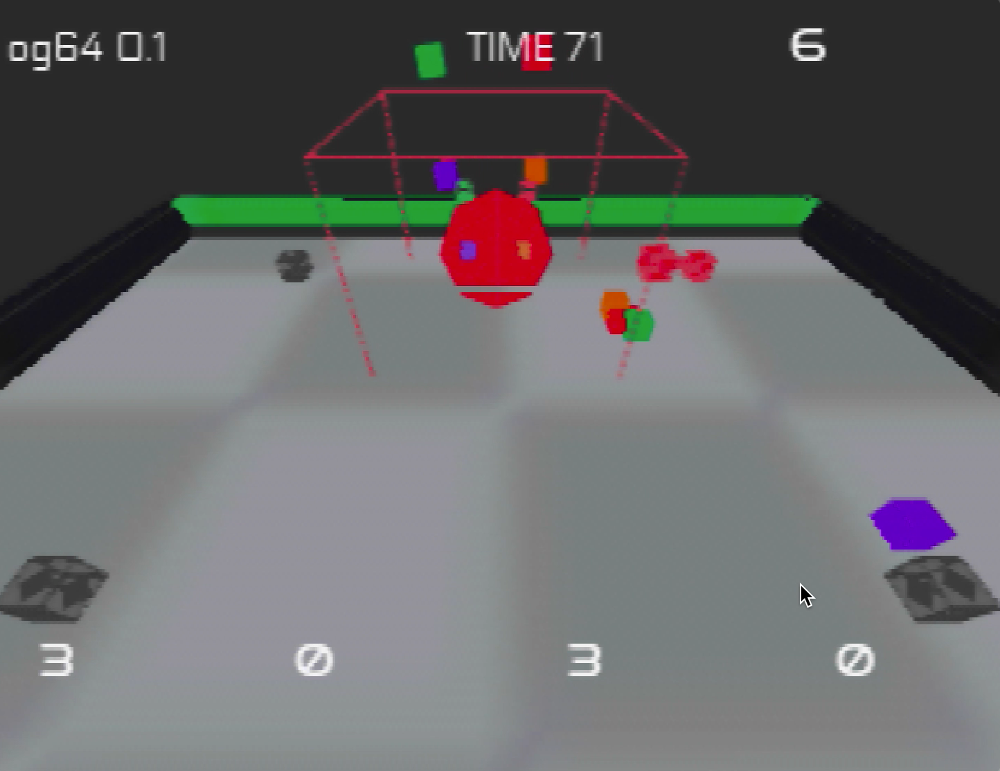

# sandbox64
Sandbox area to run experiments using libdragon for n64 game development.  
This project was used in the Griffith University 24 Hour GameJam to create the multiplayer prototype "Old Gods"
FEATURES:  
 - 3D rendering primatives
 - Basic Rigidbody Collisions and Physics
 - Multiplayer inputs, and basic gameplay
 - Sound
 - Font and sprite rendering
  

## Installation Instructions  
1\. Installing libdragon and dependencies
=========================================

First step is to install some dependencies:

-   Docker desktop

-   Node

-   Git

(1) Install Docker Desktop via winget:

winget install docker.dockerdesktop

or get from <https://www.docker.com/products/docker-desktop> (direct link to Windows/ARM64: <https://desktop.docker.com/win/main/amd64/Docker%20Desktop%20Installer.exe>). Launch Docker Desktop and sign in/click through the initial dialogs

(2) Install fnm (Fast Node Manager) from Powershell:

winget install Schniz.fnm

(3) Create or edit $profile in powershell

To get path to $profile file, run:

$profile

# or if already exists, to edit:
notepad $profile

Add the following to it:

fnm env --use-on-cd | Out-String | Invoke-Expression

(4) Install node:

# download and install Node.js
fnm use --install-if-missing 22

# use these to verify node is installed correctly (will print version numbers)
node -v
npm -v

(5) Install git:

winget install --id Git.Git -e --source winget

(6) Install libdragon:

npm i -g libdragon@latest

2\. Setting up a project
========================

(1) Create a folder for project (e.g. in $HOME\Documents create libdragon-src or similar). *cd* into it and run *libdragon init, libdragon install*:

# create the project folder and cd into it
cd $HOME\Documents
mkdir libdragon-src
cd libdragon-src

# this creates a new docker container, initialises it and mounts the libdragon directory from the docker image to the current folder
libdragon init

# then, to switch to preview branch (or to update)
git -C ./libdragon checkout preview
libdragon install

N.B. I use the preview branch because this contains OpenGL, while the regular branch is 2D only.

(2) To start / stop the container/environment from the project folder:

libdragon start
libdragon stop

To access the Linux shell inside your docker container, either use Docker Desktop, click on 'Containers', select the running container and choose the 'Exec' tab, or from powershell, run:

docker exec -it [container-id] bash

3\. Set up vscode
=================

(1) Install vscode:

winget install -e --id Microsoft.VisualStudioCode

or the old-fashioned way, from <https://code.visualstudio.com/>.

(2) Open vscode and install the extensions:

-   C/C++

-   C/C++ Extension Pack

-   Dev Containers

(others might be desirable, but these should be the basics)

(3) Make sure that the container/environment is running (e.g. via *libdragon start* from project folder - can check running state from Docker Desktop), then in vscode, press F1 and type:

>Dev Containers: Attach to Running Container...

Press Enter. Then select the name of the container (should match the container name shown in Docker Desktop)

(4) The C/C++ extension now needs to be configured for libdragon includes to be recognised properly. Press F1 and type:

>C/C++: Edit Configurations (UI)

There should be a 'Linux' configuration already set up but it will be missing a couple of things:

-   Under 'Compiler path' type:

    /n64_toolchain/bin/mips64-elf-g++

-   Under 'Include path' add:

    ${workspaceFolder}/libdragon/include/

Includes should now work - test by opening an example c file in the libdragon/examples folder and right-clicking one of the includes and clicking 'Go to Definition'. If there are red squiggles all over the place, it is probably not set up correctly.

(5) Compile the code using make / libdragon make

(6) Open the ROM (drag the .z64 file into the Ares window) - if all goes well, the line "Test" should appear at the bottom of the Ares terminal window, indicating that the debug output is working correctly

(7) The ISViewer feature can be switched on and off from menu item Tools > Tracer in Ares - there should be a 'Log to Terminal' column ticked against the item called 'Cartridge ISViewer'
